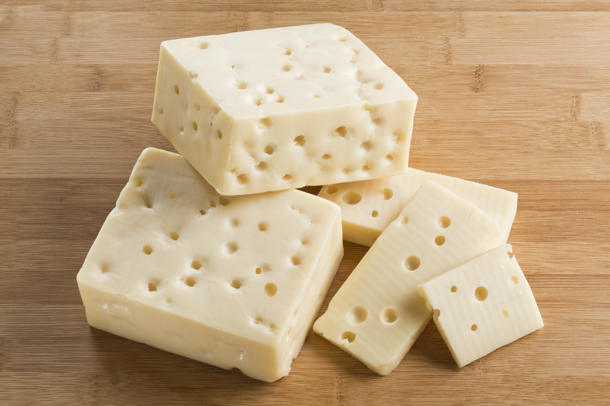

Swiss Cheese
=============

   Swiss Cheese [#f1]_
Swiss cheese is a style of cheese, originating from Switzerland. It's most likely
to appear white or yellow with decent sized holes all around a slice or chunk
of Swiss. Its the type of cheese that's most likely shown up in old fashioned
cartoons involving mice and cats, like Tom and Jerry.

History of Swiss Cheese
------------------------
`History of swiss cheese <https://www.cheesesfromswitzerland.com/en/production/the-history-of-cheese-in-switzerland>`_.

Swiss cheese was developed in Switzerland around the 14th century. Before then
cheese makers had been making cheese since Neolithic times. As Swiss people
began to incorporate more foods into their diet, specific cheeses gain surpluses.
This allowed cheeses made in Switzerland to travel outside of Switzerland and into
neighboring territories. Around the 1800's, swiss cheese as we know of it, came
into production, with the experimentation of Switzerland's lowland valleys and
central plateau dairy farms. The two pioneers were Phillip Emaneul von Fellenberg
and Rudolf Emanuel von Effinger.\

Taste
----------
Whenever I eat a slice of swiss cheese, the initial bite tastes really bland.
However, when I chew the bite more and more, the flavor starts to take shape.
Swiss cheese has a sweet curdled taste, similar to cheese topping found in Italian
pizza restaurants. If you really focus in on the taste, you can also sense
a buttery flavor as well.

Smell
------
Swiss cheese has a more authentic smell than american cheese. The aroma of the
smell makes it seem as if the cheese had just been freshly produced and come straight
from the manufacturing warehouse. Swiss cheese's mild smell also prevents you from
feeling like you want to vomit after placing it in your mouth, unlike american cheese.

Ingredients
~~~~~~~~~~~~
If you were wanting to make swiss cheese, you'd need the following list of
ingredients. You can also view a recipe for homemade swiss cheese down below.

`Swiss Cheese recipe <https://www.culturesforhealth.com/learn/recipe/cheese-recipes/swiss-cheese/>`_.

- Dairy products
    - Fresh milk
    - Thermophillic culture

- Non dairy products
    - Water
    - Olive oil
    - Animal rennet
    - Vegetable rennet

Uses
~~~~~
Swiss cheese has a couple uses; cooking and/or snacking. If used in cooking,
swiss cheese could be used as a topping or ingredient for a multitude of
dishes, including...

==============  =============  =============
sandwiches      tacos          lasagna
pizza           pasta          spaghetti
eggs            burritos       mac & cheese
==============  =============  =============

.. [#f1] "`Aged Swiss Cheese <https://goldenagecheese.com/product/aged-swiss-cheese-3/>`_".
   Golden Age Cheese. 2021. Retrieved 2021-12-08.